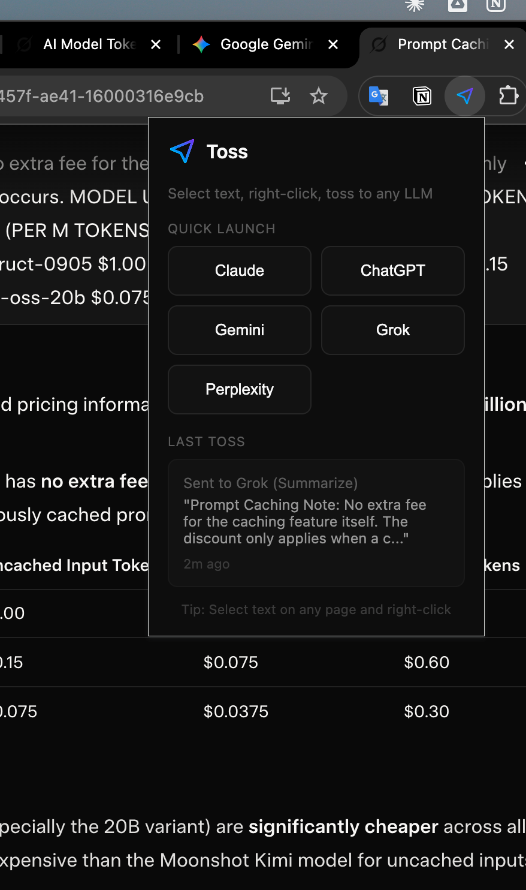
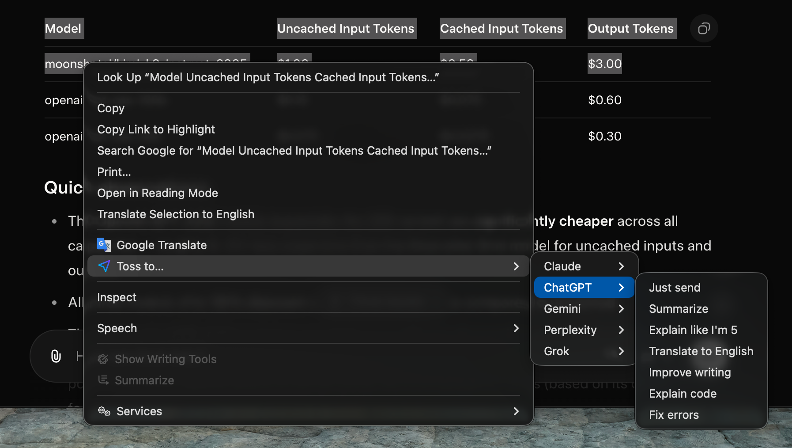

# Toss

Send selected text to any LLM in one click. No more copy-paste-tab-paste-enter.

## Screenshots

| Popup | Right-Click Menu |
|-------|------------------|
|  |  |

## Features

- **Right-click to toss** - Select text anywhere, right-click, send to your chosen LLM
- **5 LLMs supported** - Claude, ChatGPT, Gemini, Grok, Perplexity
- **Prompt templates** - Summarize, ELI5, Translate, Improve writing, Explain code, Fix errors
- **Keyboard shortcuts** - Toss instantly without touching your mouse
- **Auto-paste & auto-send** - Opens the LLM with your text already submitted

## Installation

### From Chrome Web Store
[Coming soon]

### Manual Installation (Developer Mode)
1. Clone this repo or download as ZIP
2. Open `chrome://extensions` in Chrome
3. Enable "Developer mode" (top right)
4. Click "Load unpacked"
5. Select the `toss-extension` folder

## Usage

### Right-Click Menu
1. Select any text on any webpage
2. Right-click → "Toss to..." → Choose LLM → Choose template
3. Text is pasted and sent automatically

### Keyboard Shortcuts
| Shortcut | LLM |
|----------|-----|
| `Cmd/Ctrl+Shift+C` | Claude |
| `Cmd/Ctrl+Shift+O` | ChatGPT |
| `Cmd/Ctrl+Shift+G` | Gemini |
| `Cmd/Ctrl+Shift+X` | Grok |

Set a custom shortcut for Perplexity at `chrome://extensions/shortcuts`

### Prompt Templates
| Template | Prefix |
|----------|--------|
| Just send | *(none)* |
| Summarize | "Summarize this:" |
| Explain like I'm 5 | "Explain this like I'm 5:" |
| Translate to English | "Translate this to English:" |
| Improve writing | "Improve the writing of this text:" |
| Explain code | "Explain what this code does:" |
| Fix errors | "Fix any errors in this:" |

## Privacy

- All data stays in your browser
- Nothing is sent to external servers
- Only stores your last toss locally (for the popup display)

See [PRIVACY_POLICY.md](PRIVACY_POLICY.md) for details.

## Permissions

| Permission | Why |
|------------|-----|
| `contextMenus` | Right-click "Toss to..." menu |
| `storage` | Remember last toss locally |
| `scripting` | Paste and send text on LLM sites |
| Host permissions | Access Claude, ChatGPT, Gemini, Grok, Perplexity |

## Development

```bash
# Clone the repo
git clone https://github.com/YOUR_USERNAME/toss-extension.git

# Load in Chrome
# 1. Go to chrome://extensions
# 2. Enable Developer mode
# 3. Click "Load unpacked"
# 4. Select the toss-extension folder

# After making changes, click the refresh icon on the extension card
```

## Contributing

Issues and PRs welcome!

## License

MIT
